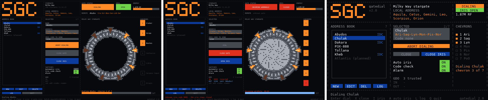
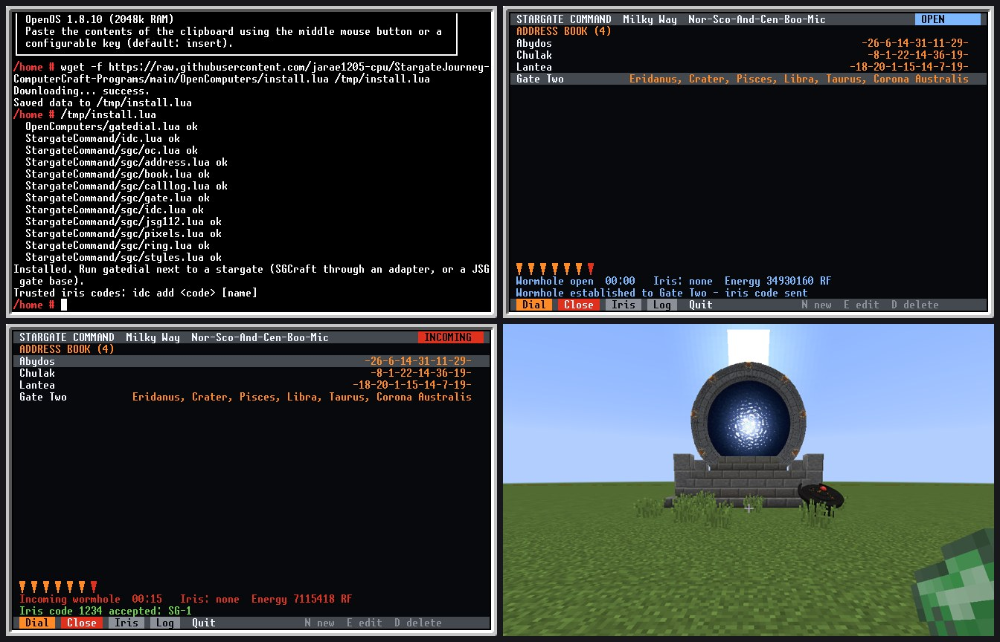
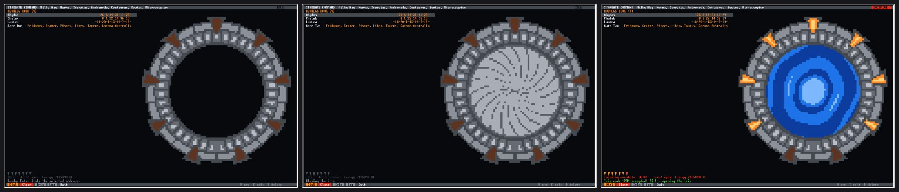
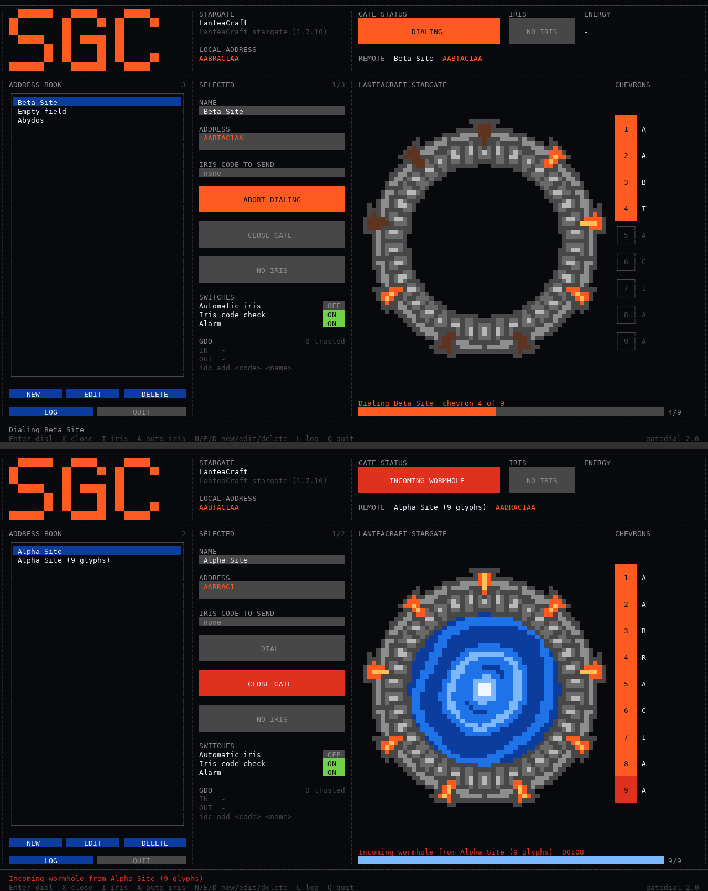
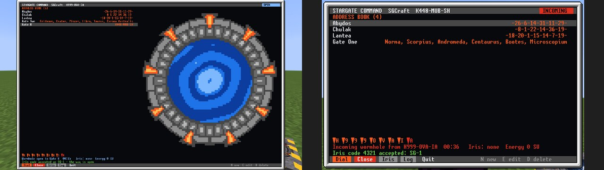

# gatedial for OpenComputers

A stargate dialing computer for **OpenComputers** (OpenOS), for the gate mods that talk to OpenComputers:

- **SGCraft**: Greg Ewing's original (1.7.10) and SGCraft 2.x (1.12.2)
- **Just Stargate Mod** for Minecraft 1.12.2 (JSG), Milky Way, Pegasus and Universe gates
- **LanteaCraft** 0.2.5+ for Minecraft 1.21.1, with an OpenComputers port for 1.21.1 (see the note under [Connect the gate](#connect-the-gate))
- **LanteaCraft for Minecraft 1.7.10**, the mod's 2014–2015 releases (see [LanteaCraft on 1.7.10](#lanteacraft-on-1710))

It is the OpenComputers version of the [Personal Dialer](../PersonalDialer/) and the [Gate Room](../StargateCommand/). It keeps the same address book, trusted iris codes and gate log, so a book written on one computer works on the other. It does not need the Auspex Gate Systems programs.

On a tier 2 or tier 3 screen, gatedial 2.0 opens on the **console**: a control screen with panels, made for a gate room. It has the address book, the selected address with big Dial, Close Gate and Iris buttons, switches, the GDO (iris codes in and out) and the gate with a box for each chevron.




*The console on a JSG 1.12.2 Milky Way gate. Top: a tier 3 screen (160x50) with the wormhole open to Abydos and the iris code sent. Bottom, left to right: dialing Abydos; another gate dialed in, the automatic iris closed, and code 9999 was rejected; a tier 2 screen (80x25) dialing Chulak. These screens were rendered from a headless OpenOS test harness with a simulated gate, not captured in-game.*

The gatedial 1.0 screen is still there: set `screen = "classic"` (see [Settings](#settings)).


*Left: dialing Abydos on an SGCraft gate, with a tier 3 screen and graphics card (160x50). Right: a JSG 1.12.2 gate on a tier 2 screen (80x25), with the wormhole open and the iris code sent, then a player coming through an incoming wormhole. These screens were rendered from a headless OpenOS test harness with simulated gates, not captured in-game.*



*In a Minecraft 1.12.2 world with OpenComputers 1.8.10 and Just Stargate Mod 4.11.2.8. Top left: the installer, downloaded with `wget` on an in-game computer. Top right: gatedial has dialed the other gate and sent its iris code. Bottom left: the computer at the other gate as that call comes in; the code 1234 is accepted. Bottom right: the gate with its wormhole open.*



*A tier 3 screen in the same world, cabled to a JSG gate with a creative iris set to OC mode. Left: the gate picture beside the address book. Middle: the iris closed with the I key. Right: another gate dials in and sends a trusted code, and gatedial opens the iris by itself.*


*SGCraft 1.13.3 and OpenComputers 1.8.10 in a Minecraft 1.7.10 world. Top left: one computer dials the other gate and sends the code 4321; the other side answers that it was accepted. Top right: at the other gate the iris was shut, so gatedial opens it for the trusted code. Bottom left: the same call with an unknown code; the iris stays shut. Bottom right: that gate with its iris closed over the wormhole.*

## Install

You need an internet card. In the OpenOS shell:

```
wget -f https://raw.githubusercontent.com/jarae1205-cpu/StargateJourney-ComputerCraft-Programs/main/OpenComputers/install.lua /tmp/install.lua
/tmp/install.lua
```

This puts `gatedial` and `idc` in `/home/bin` and the `sgc` library in `/home/lib/sgc`. Run the installer again to update; it downloads every file before it changes anything. Your address book, iris codes and gate log stay as they are. Then `reboot`: OpenOS keeps the libraries it has loaded in memory, so until a reboot the computer keeps using the old ones.

## Connect the gate

- **SGCraft**: place SGCraft's OpenComputers interface block directly under the gate's base and connect it to the computer with cable. It shows up as a `stargate` component.
- **JSG 1.12.2**: connect the gate's base block to the computer with cable. It is a `stargate` component too. To open and close the iris from the computer, set the iris mode to OC in the gate's GUI.
- **LanteaCraft**: connect the gate's base block to the computer with cable. gatedial handles LanteaCraft the same way as the ComputerCraft programs do; see the [LanteaCraft notes](../StargateCommand/README.md#lanteacraft-notes). But LanteaCraft 0.2.5 can't load alongside OpenComputers: Modernized 1.10.0 to 1.10.7, the OpenComputers port for 1.21.1: the game stops at startup with "Please register all drivers in the init phase". LanteaCraft adds its OpenComputers driver after OpenComputers has closed its driver list, so this needs a fix in LanteaCraft. Until then, use the ComputerCraft programs with LanteaCraft. gatedial's LanteaCraft support has only been tested against a simulated gate.

JSG closes a wormhole by itself when no player has been nearby for 5 seconds ("Autoclose" in JSG's `stargates.cfg`). gatedial logs that as a close with the reason Autoclose. Raise the time or turn it off in that config if your computers should keep wormholes open on their own.

- **LanteaCraft for 1.7.10**: put an OpenComputers **Adapter** against the gate's base block and cable the computer to it. The gate shows up as a `stargate` component. An Adapter against the DHD (LanteaCraft's Stargate Controller) gives a `stargate_controller` instead, which can't dial.

Then run `gatedial`. Run `components` in the shell if the gate is not found.

## Screen

A tier 2 screen and graphics card is enough. gatedial uses the largest resolution the graphics card and screen allow.

**The console** (tier 2 or tier 3):

- **Header**: the logo, the gate's type and local address, and badges for the gate status (idle, dialing, wormhole open, incoming; it flashes while another gate dials in), the iris and the gate's energy. On tier 3 it also names the gate on the other side.
- **Address book**: tap an address to select it, tap it again to dial. `IDC` marks addresses with an iris code to send. New, Edit, Delete and Log buttons sit under the list.
- **Selected**: the name, address and iris code of the selected address, then the big buttons: **Dial** (Abort while dialing), **Close Gate**, and **Open Iris** or **Close Iris**.
- **Switches**: automatic iris, iris code check and alarm, which you turn on and off by tapping them. The console remembers them.
- **GDO**: the last iris code that came in and whether it was accepted, the last code you sent and the answer, and how many codes are trusted.
- **The gate** (tier 3): the gate picture, with its chevrons lighting as they lock, the wormhole and the iris. Beside it is a box for each chevron with its symbol, and under it the wormhole's time and a bar of locked chevrons. On tier 2 the chevrons are a list.

Tapping the iris badge in the header opens or closes the iris too. The gate log opens over the address book; Back returns to it.

**The classic screen** (`screen = "classic"`, and on a tier 1 screen): the address book as a list, with the chevrons and the gate state under it. With tier 3 it also draws the gate beside the list.

## Keys

| Key | Does |
| --- | --- |
| Up / Down | pick an address |
| Enter | dial it |
| X | close the wormhole, or stop dialing |
| I | open or close the iris |
| A | automatic iris on or off |
| N / E / D | new address, edit, delete |
| L | the gate log |
| Q | quit |

X, I and A also work while the gate log is open.

On a touch screen, tap an address to pick it and tap it again to dial. The buttons do the same as the keys. New and Edit ask their questions on the computer's keyboard.

New and edit ask for a name, an address and the iris code to send when you dial it. When you edit, each question shows the current value in [brackets]: press Enter to keep it, or type `-` to clear it. Addresses are typed the way the gate shows them: SGCraft letters such as `WLDQ-DQB-MT`, or JSG symbol names separated by commas such as `Aquila, Cetus, Gemini, Leo, Scorpius, Orion`. An entry with the wrong kind of address for the gate is shown but not dialed.

## Iris codes

Iris codes work the same as in the [Gate Room](../StargateCommand/README.md#iris-codes-and-the-gate-log):

- When you dial an entry that has an iris code, gatedial sends it as soon as the wormhole opens.
- When another gate dials in and sends a code, gatedial opens the iris if the code is trusted and answers "accepted". An unknown code gets "rejected", and the iris stays shut.
- Trust codes with `idc add 1234 SG-1`. `idc` lists them, `idc remove 1234` stops trusting one and `idc log` prints the gate log.

With SGCraft the codes go as gate messages, the same as from the ComputerCraft programs. JSG 1.12.2 has its own iris code system (the GDO), so gatedial uses that: the code arrives as JSG's `received_code` signal and the answer goes to the traveller's GDO.

Turn on **Automatic iris** on the console (or press A) to close the iris whenever another gate dials in. The GDO panel shows the last code in each direction.

## Shared files

| File | What |
| --- | --- |
| `/home/dialer_addresses.db` | the address book |
| `/home/iris_codes.db` | trusted iris codes |
| `/home/gate_log.db` | the gate log |

These are the same files the ComputerCraft programs keep at the root of a computer, in the same format. Copy them across to move an address book between the two.

## Settings

At the top of `gatedial.lua`:

- `screen`: `"console"` (the default) or `"classic"` for the gatedial 1.0 screen
- `logo`: the big letters at the top of the console, `"SGC"` by default. Letters, digits, `-` and spaces; a name too long for the big letters is written in plain text
- `irisCodes`: check iris codes from the gate that dialed in (on by default)
- `autoIris`: close the iris when another gate dials in (off by default)
- `alarm`: beep while another gate is dialing in
- `gatePicture`: draw the gate on a tier 3 screen
- `pollInterval`: seconds between gate checks

`irisCodes`, `autoIris` and `alarm` are where the console's switches start. Once you flip a switch on the console (or press A), gatedial keeps that choice in the address book's settings, and it wins over the value here.

## LanteaCraft on 1.7.10

LanteaCraft's 1.7.10 builds give a computer very little: `dial`, `disconnect`, and whether the gate is busy, dialing or complete. gatedial fills in the rest from the gate's own signals.

- **Addresses** are 7 or 9 glyphs from A–Z, 0–9, `-` and `+`, typed as the gate shows them, such as `K3-+QPAAA`. Seven glyphs reach a gate in the same dimension; nine reach another dimension.
- **Seven or nine chevrons**: A gate dials nine glyphs only if the two ring places two blocks to either side of the base, in the bottom row, hold chevrons. With plain ring blocks there it has seven chevrons, and LanteaCraft stops a nine-glyph dial after the sixth chevron. gatedial then says "This gate has 7 chevrons: it can't dial a 9-glyph address"; dial the first seven glyphs to reach a gate in the same dimension.
- **Dialing**: one call dials the whole address, about 2.5 seconds a chevron. The chevrons light from the gate's `sgChevronEncode` signals.
- **No gate there**: LanteaCraft accepts any well-formed address, dials every chevron, and only then gives up. gatedial reports "No gate answered at that address" (there was no gate, or it was busy).
- **Incoming wormholes**: the gate sends the caller's address one glyph per chevron. gatedial puts it together, so the caller is named when the wormhole opens. A caller that dialed seven glyphs is in the same dimension, so gatedial adds this gate's last two glyphs and finds it under its full address.
- **Closing** works from either end (LanteaCraft's `closeFromEitherEnd`, on by default). A wormhole closes by itself after 5 minutes (`secondsToStayOpen`).
- **No iris and no iris codes**: LanteaCraft 1.7.10 doesn't let a computer move an iris or send anything through the wormhole. gatedial shows NO IRIS, and an entry's iris code isn't sent.
- If gatedial starts while a wormhole is already open, it can't tell which way it goes and shows it as incoming.
- **Keep both gates' chunks loaded** while you use them: stand nearby, or build by the world spawn or use a chunk loader. LanteaCraft 1.7.10 doesn't save its ring blocks, so when a gate's chunk unloads and loads again the gate drops out of its call (the other side stays open) and stops counting as a built gate. This is LanteaCraft's own behaviour, seen in the test world below.



*gatedial on tier 3 screens in a Minecraft 1.7.10 world. Top: station A dialing Beta Site, four of nine chevrons locked. Bottom: at Beta Site, the wormhole from station A is open; the caller's glyphs added up to an address in the book, so it is named. These are the computers' own screens, read from the server (see [Tested](#tested)).*

## Tested

**The console (gatedial 2.0)** has only been tried in a headless OpenOS test harness, with a simulated JSG 1.12.2 gate, on tier 3 (160x50) and tier 2 (80x25) screens: dialing, closing, an incoming wormhole with the automatic iris, iris codes accepted and rejected, the switches, the buttons by touch, adding an address and the gate log. It has not been tried in a game yet. The gate code underneath is the same as in gatedial 1.0, which was tested in the games below; if the console misbehaves, `screen = "classic"` brings back the 1.0 screen.

**In a Minecraft 1.12.2 world** (Forge 14.23.5.2860) with OpenComputers 1.8.10 and Just Stargate Mod 4.11.2.8. Computers were cabled to the bases of two JSG Milky Way gates:

- The installer, typed into OpenOS on a computer with an internet card, downloaded every file from GitHub.
- gatedial found the gate and showed its address, state and energy. It dialed the other gate one symbol at a time; the wormhole opened and the iris code was sent.
- At the other gate, gatedial showed the incoming wormhole. The code arrived through JSG's GDO and was accepted, after `idc add 1234 SG-1`.
- Closing worked from either computer, and both gate logs recorded the calls.
- On a tier 3 screen the gate picture showed the chevrons locking, the wormhole and the iris.
- With a creative iris in OC mode, the I key closed and opened it. When a trusted code came in while it was shut, gatedial opened it.
- The test found two bugs, both fixed. JSG gives `dialedAddress` as a string, and a gate stays busy for a moment after each chevron locks. Before the fixes, every dial failed with "Chevron 1 did not lock".

**In a Minecraft 1.7.10 world** (Forge 10.13.4.1614) with SGCraft 1.13.3 and OpenComputers 1.8.10. Two gates each had an OpenComputers interface under the base, cabled to a computer with a tier 2 screen:

- The installer worked, and gatedial found each gate by its SGCraft address.
- It dialed the other gate's nine symbols, the wormhole opened and the iris code went across as a gate message.
- The other computer accepted the code and answered, and the dialing side showed "Iris code accepted".
- With an iris upgrade on the gate, the I key closed the iris. A trusted code opened it; an unknown code was rejected and the iris stayed shut, and both sides said so.
- Closing worked from the receiving side, and the gate log recorded the call, the code and the close.
- The test found three bugs, all fixed:
  - gatedial showed a tenth chevron on SGCraft gates.
  - Editing an entry blanked the fields you didn't retype. Now each question shows the current value.
  - X and I did nothing while the gate log was open.

**In a Minecraft 1.12.2 world** with SGCraft 2.3.0 and OpenComputers 1.8.10. Two gates were built with SGCraft's test spawner, each with an OpenComputers interface under its base, cabled to a computer:

- gatedial found each gate by its address, `H999-OVA-IA` and `K448-MUB-SH`.
- It dialed the other gate's nine symbols, and the iris code was sent and accepted.
- At the other gate, the incoming wormhole was recognised from the dialing direction. SGCraft 2.3 sends no `sgDialIn`.
- Closing worked from the receiving side, and the gate log recorded the call, the code and the close.
- SGCraft 2.3 turns its ring to every symbol, so this dial took about 50 seconds. gatedial gave the whole dial 60 seconds, so a slower gate or a longer trip would have given up halfway. The limit is now 60 seconds per chevron.



*SGCraft 2.3.0 in a Minecraft 1.12.2 world. Left: the dialing computer, with all nine chevrons locked, the wormhole open and the code accepted. Right: the computer at the other gate, with the incoming wormhole and the code it accepted.*

**In a Minecraft 1.7.10 world with LanteaCraft** (Forge 10.13.4.1614, OpenComputers 1.8.10). LanteaCraft was built from its `1.7.10-legacy-patches` source, the last 1.7.10 line it released, with two one-line changes so it compiles against this Forge (a renamed glowstone item and fluid field; neither touches gates or computers). Two gates stood by the world spawn, station A with nine chevrons and station B with seven, each with an Adapter against its base and a tier 3 computer and screen running gatedial. A small test mod built them, turned the computers on, pressed keys and read the screens from the server console.

- gatedial found each gate as a LanteaCraft stargate (1.7.10) and showed its address, `DAB6AA0AA` and `DAB4AA0AA`.
- A dialed B's nine glyphs; the chevrons lit one by one and the wormhole opened. B raised the alarm while A dialed, then named the caller from its glyphs.
- B closed the wormhole with X from the receiving side.
- B dialed A's first seven glyphs and connected; A named B by its full nine-glyph address.
- B dialing nine glyphs stopped after the sixth chevron with the seven-chevron message. A dialing an address with no gate went through all nine chevrons and reported "No gate answered at that address".
- Both gate logs recorded every call, close and failure.
- The test found three bugs, all fixed:
  - OpenComputers puts a component address before a signal's arguments, so no chevrons were counted and no callers named.
  - A seven-chevron gate stopping a nine-glyph dial was reported as "No gate answered".
  - A caller that dialed seven glyphs wasn't found under its nine-glyph entry.
- In an earlier run, station B was far from the spawn and its chunk unloaded during the call. LanteaCraft dropped it from the call and it stopped counting as a built gate (see the chunk note under [LanteaCraft on 1.7.10](#lanteacraft-on-1710)).

Before that, the same scenarios ran in a headless OpenOS test harness against a gate simulated from LanteaCraft's source; the harness now includes what the game showed.

Please open an issue if a gate behaves differently.
